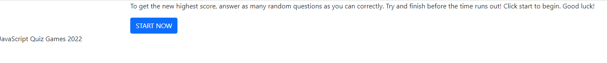
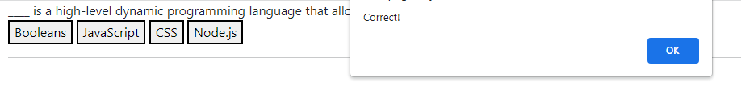
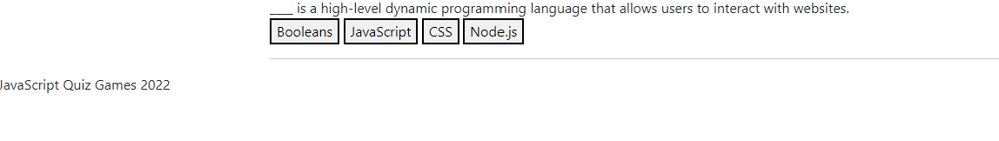

# Show-n-Tell

## Description

This game was created to test the user on JavaScript knowledge and ability to complete the test before the time runs out. My motivation is to test and retain new JavaScript knowlegde. This quiz helps make studying fun! This solves the problem of not knowing exactly what to study and test on JavaScript objectives.

## Installation

GitHub URL: https://github.com/brittanyb89/Show-n-Tell
Web URL: https://brittanyb89.github.io/Show-n-Tell/

## Usage

STEP 1: Click the startquiz button to begin quiz

STEP 2: You will be presented with the first question. Select the correct answer and an alert would appear letting you know if the answer is correct or incorrect.

[incorrect](assets/incorrect%20alert.png)

STEP 3: After clicking the ok button in the alert box, the next question would appear.

!

STEP 4: Once you reach the end of the quiz, you are presented with an input box to enter your initials and save final score to local storage.

STEP 5: Saved initials and score would then appear on the screen.

## Credits

https://developer.mozilla.org/en-US/docs/Web/HTML/Element/input/button

https://stackoverflow.com/questions/16562577/how-can-i-make-a-button-redirect-my-page-to-another-page

https://getbootstrap.com/docs/5.1/components/close-button/

https://css-tricks.com/snippets/css/a-guide-to-flexbox/

## License

MIT License

Copyright (c) 2022 Brittany Burton

Permission is hereby granted, free of charge, to any person obtaining a copy of this software and associated documentation files (the "Software"), to deal in the Software without restriction, including without limitation the rights to use, copy, modify, merge, publish, distribute, sublicense, and/or sell copies of the Software, and to permit persons to whom the Software is furnished to do so, subject to the following conditions:

The above copyright notice and this permission notice shall be included in all copies or substantial portions of the Software.

THE SOFTWARE IS PROVIDED "AS IS", WITHOUT WARRANTY OF ANY KIND, EXPRESS OR IMPLIED, INCLUDING BUT NOT LIMITED TO THE WARRANTIES OF MERCHANTABILITY, FITNESS FOR A PARTICULAR PURPOSE AND NONINFRINGEMENT. IN NO EVENT SHALL THE AUTHORS OR COPYRIGHT HOLDERS BE LIABLE FOR ANY CLAIM, DAMAGES OR OTHER LIABILITY, WHETHER IN AN ACTION OF CONTRACT, TORT OR OTHERWISE, ARISING FROM, OUT OF OR IN CONNECTION WITH THE SOFTWARE OR THE USE OR OTHER DEALINGS IN THE SOFTWARE.
